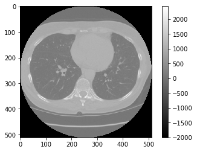

# LungCancerPrediction
My personal solution of data science bowl 2017
### Data Preprocessing
I have not precess the dicom image before, so I adapt some preprocess procedure from those 2 well written tutorial on kaggle [Tutorial 1](https://www.kaggle.com/sentdex/data-science-bowl-2017/first-pass-through-data-w-3d-convnet),
[2](https://www.kaggle.com/gzuidhof/data-science-bowl-2017/full-preprocessing-tutorial)

Since the image is scanned the in cylinder shape, the outside body part comes with a HU value -2000, which should set to 0.

Before             |  After
:-------------------------:|:-------------------------:
  |  

| Substance             | HU                                              |
|-----------------------|-------------------------------------------------|
| Air                   | −1000                                           |
| Lung                  | −500                                            |
| Fat                   | −100 to −50                                     |
| Water                 | 0                                               |
| CSF                   | 15                                              |
| Kidney                | 30                                              |
| Blood                 | +30 to +45                                      |
| Muscle                | +10 to +40                                      |
| Grey matter           | +37 to +45                                      |
| White matter          | +20 to +30                                      |
| Liver                 | +40 to +60                                      |
| Soft Tissue, Contrast | +100 to +300                                    |
| Bone                  | +700 (cancellous bone) to +3000 (cortical bone) |
